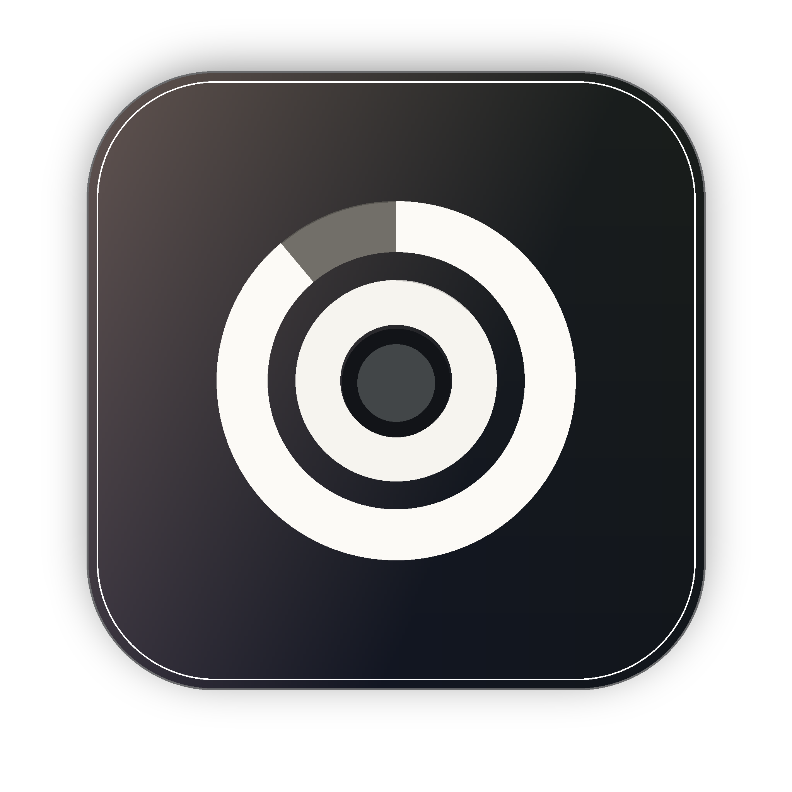
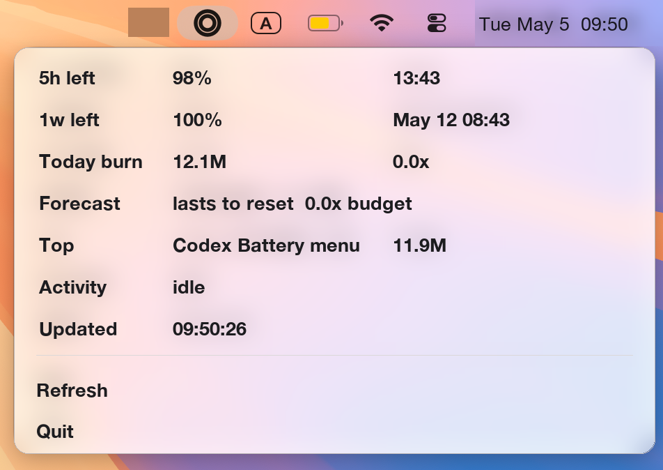
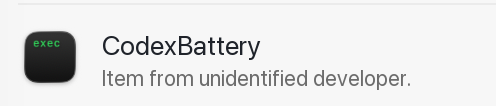

# Codex Battery

[中文说明](README.zh-CN.md)



A tiny macOS menu bar quota indicator for Codex.



Codex Battery turns Codex usage limits into a compact menu bar signal:

- Outer ring: weekly quota remaining
- Inner ring: 5-hour quota remaining
- Menu details: reset times, today's token burn, weekly budget forecast, the top active Codex thread, recent background activity, and the data timestamp

It is local-only, lightweight, and designed for people who keep checking quota while doing long agentic work.

## Why

Codex is powerful enough that quota becomes a real workflow constraint. The official usage UI is useful, but it lives inside the app. Codex Battery keeps the important signal in your macOS menu bar, like a laptop battery indicator.

Use it to answer:

- Am I close to the 5-hour wall?
- Will my weekly quota last until reset?
- Is today's usage unusually heavy?
- Which Codex thread is burning the most tokens?

If you rename a Codex thread in the sidebar, the `Top` row uses that renamed title when Codex writes it to the local session index.

## Install

Requirements:

- macOS 14+
- Xcode Command Line Tools, including `swiftc`
- Codex desktop app with local state under `~/.codex`

### Homebrew

```bash
brew install EOShoow/tap/codex-battery
codex-battery
```

Optional login startup:

```bash
codex-battery-login install
```

Remove the login item:

```bash
codex-battery-login uninstall
```

### From Source

```bash
git clone https://github.com/EOShoow/codex-battery.git
cd codex-battery
./install.sh
```

The app is built to:

```text
~/Applications/CodexBattery.app
```

The login item is installed at:

```text
~/Library/LaunchAgents/local.codex.battery.menu.plist
```

### About the "unidentified developer" warning



Codex Battery is not signed with a paid Apple Developer ID yet, so macOS may show it as coming from an "unidentified developer" in Login Items or Gatekeeper prompts.

That warning is about Apple code-signing identity, not about data collection. This project is open source, installs from this repository, asks the local Codex app-server for quota status, and reads local Codex state under `~/.codex` for fallback statistics.

If you are cautious, inspect the source first and install from source with `./install.sh`. The current Homebrew formula also builds the app locally from this repository instead of downloading a closed binary.

## Reading The Menu

Example in English:

```text
5h left     82%    18:44
1w left     96%    May 12 08:43
Today burn  76.2M  0.3x
Forecast    safe  active pace 0.6x
Top         Codex Battery  21.5M
Activity    1 thread active in 2m
Data at     18:43:17
```

Example in Chinese:

```text
5小时剩余  82%    18:44
1周剩余    96%    5月12日 08:43
今日消耗    76.2M  0.3x
周预测      很安全  活跃节奏 0.6x
Top         Codex Battery  21.5M
后台活动    近2分钟 1个线程仍在消耗
数据于      18:43:17
```

`active pace 1.0x` means your weekly usage is exactly on the active-hour budget line. Codex Battery counts recent 5-minute active buckets and compares them against an 8h/day workday budget, so sleep and other idle hours do not make the forecast look worse.

- Below `1.0x`: safer than budget
- Around `1.0x`: on track to reach reset exactly
- Above `1.0x`: ahead of budget and may run out early

`Data at` is the time of the quota snapshot. In normal operation it comes from Codex app-server's `account/rateLimits/read` response, which matches the native Codex quota panel more closely. If that request fails, Codex Battery falls back to the latest local `token_count` event, and then this time reflects that event timestamp.

If a 5-hour or weekly reset window has already passed but Codex has not written a fresh usage event yet, Codex Battery treats that window as reset and shows `100%` plus `reset`.

If a row is truncated, hover it to see the full value in a tooltip.

## Refresh Behavior

Codex Battery refreshes:

- At startup
- When you click `Refresh`
- Every 30 minutes while idle
- Every 5 minutes when recent Codex activity is detected
- Every 5 minutes after a failed refresh

Opening the menu does not refresh by default, because quota refresh starts the local Codex app-server and can cost power. If you want the old behavior, enable `Sync on open: On` in the menu.

You can tune the automatic intervals:

```bash
defaults write local.codex.battery.menu activeRefreshMinutes -int 5
defaults write local.codex.battery.menu idleRefreshMinutes -int 30
defaults write local.codex.battery.menu failureRetryMinutes -int 5
```

To keep power use low, it asks the local Codex app-server for the current account quota, then checks only the most recent active threads and reads the tail of each rollout log for today/top/forecast statistics.

When background Codex work is still running, the menu shows an `Activity` line such as `2 thread(s) active in 2m`. That is a reminder that quota may keep moving even if you are not actively typing in the current thread.

If Codex is temporarily writing, checkpointing, or migrating `~/.codex/state_5.sqlite`, a read can fail for a moment. Codex Battery retries several times. If it still cannot read the database but has a previous successful snapshot, it keeps showing that snapshot and marks the check as `Stale` instead of replacing the menu with an error.

## Accuracy

This is an unofficial local dashboard. Current 5-hour and weekly quota are read from the same local Codex app-server account-rate-limit path used by the native UI. Today/top/forecast statistics still come from local rollout logs, so those secondary statistics can lag if Codex has not flushed the latest usage event yet.

Treat it as a fast dashboard, not an accounting source of truth.

## Compatibility

Codex Battery depends on Codex Desktop's local app-server protocol and local state format, especially `account/rateLimits/read`, `~/.codex/state_5.sqlite`, and the rollout log entries referenced by that database.

This is not an official public Codex API. If a future Codex Desktop update changes the app-server protocol, local database schema, log path layout, or `token_count` event format, Codex Battery may stop showing data until it is updated.

Current known baseline:

- Verified with Codex Desktop `26.429.30905` / app-server protocol as of 2026-05-05
- Reads quota through local `codex app-server` method `account/rateLimits/read`
- Reads `~/.codex/state_5.sqlite`
- Reads recent rollout logs that contain `token_count.rate_limits`

If it breaks after a Codex update, please open an issue with your Codex version, macOS version, and the error text shown by the menu. Do not paste private rollout logs unless you have reviewed and redacted them.

## Feedback

- Compatibility reports: [open a compatibility issue](https://github.com/EOShoow/codex-battery/issues/new?template=compatibility-report.yml)
- Bugs: [open a bug report](https://github.com/EOShoow/codex-battery/issues/new?template=bug-report.yml)
- Questions and setup notes: [GitHub Discussions](https://github.com/EOShoow/codex-battery/discussions)

## Privacy

Codex Battery does not upload your rollout logs, thread contents, or statistics. For the primary quota number it starts the local Codex app-server and asks for `account/rateLimits/read`; depending on Codex internals, that app-server request may contact Codex/OpenAI using your existing Codex login, similar to opening the native quota panel.

It also reads locally:

- `~/.codex/state_5.sqlite`
- recent rollout log paths referenced by that database

Thread titles are displayed locally so you can see which conversation is consuming tokens.

## Update

```bash
git pull
./install.sh
```

## Uninstall

```bash
./uninstall.sh
```

## Build Manually

```bash
./build.sh
open ~/Applications/CodexBattery.app
```

## Status

Early release. Codex's local state format may change, so pull requests and issue reports are welcome.

## License

MIT
