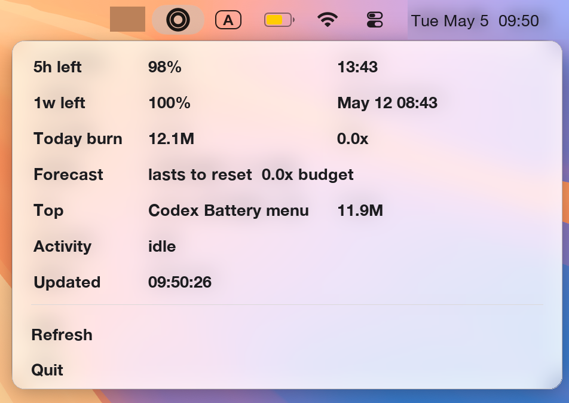
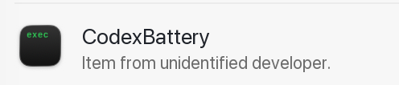

# Codex Battery

[中文说明](README.zh-CN.md)


A tiny macOS menu bar quota indicator for Codex.



Codex Battery turns Codex usage limits into a compact menu bar signal:

- Quota rings adapt to the windows returned by Codex: two rings show weekly + 5-hour remaining, while a weekly-only response shows one outer ring
- Center dice pips: available full-reset credits, visually capped at six while the tooltip keeps the exact count
- Icon style: choose **Rounded dice (reset credits)** or **Round bolt (service tier)** from the `Icon Style` menu; the choice is remembered locally
- Menu details: reset times, available full-reset credits and their expiry dates, today's token burn, quota burn reference, weekly budget forecast, the top active Codex thread, recent background activity, and the data timestamp

It is local-only, lightweight, and designed for people who keep checking quota while doing long agentic work.

## Why

Codex is powerful enough that quota becomes a real workflow constraint. The official usage UI is useful, but it lives inside the app. Codex Battery keeps the important signal in your macOS menu bar, like a laptop battery indicator.

Use it to answer:

- Am I close to the 5-hour wall?
- Will my weekly quota last until reset?
- How many tokens have I used today?
- Which Codex thread is burning the most tokens?

If you rename a Codex thread in the sidebar, the `Top` row uses that renamed title when Codex writes it to the local session index.

## Install

Requirements:

- macOS 14+
- Xcode Command Line Tools, including `swiftc`
- Codex desktop app with local state under `~/.codex`

### Homebrew

```bash
brew install EOShoow/tap/codex-battery
codex-battery
```

Optional login startup:

```bash
codex-battery-login install
```

Remove the login item:

```bash
codex-battery-login uninstall
```

### From Source

```bash
git clone https://github.com/EOShoow/codex-battery.git
cd codex-battery
./install.sh
```

The app is built to:

```text
~/Applications/CodexBattery.app
```

The login item is installed at:

```text
~/Library/LaunchAgents/local.codex.battery.menu.plist
```

### About the "unidentified developer" warning



Codex Battery is not signed with a paid Apple Developer ID yet, so macOS may show it as coming from an "unidentified developer" in Login Items or Gatekeeper prompts.

That warning is about Apple code-signing identity, not about data collection. This project is open source, installs from this repository, asks the local Codex app-server for quota status, and reads local Codex state under `~/.codex` for fallback statistics.

If you are cautious, inspect the source first and install from source with `./install.sh`. The current Homebrew formula also builds the app locally from this repository instead of downloading a closed binary.

## Reading The Menu

Example in English (the forecast row is graphical in the app):

```text
5h left     82%    18:44
1w left     96%    May 12 08:43
Resets       4     nearest expires May 10 ›
Today burn  76.2M
Quota burn today ~4%   cycle 4% · typical 17%/day
Forecast    risk of running out early  low · 2 cycles
Top         Codex Battery  21.5M
Activity    1 thread active in 2m
Data at     18:43:17
```

Example in Chinese:

```text
5小时剩余  82%    18:44
1周剩余    96%    5月12日 08:43
今日消耗    76.2M
额度油耗    今日约 4%   本期4% · 常态17%/日
周预测      存在提前用完风险  低 · 常态2期
Top         Codex Battery  21.5M
后台活动    近2分钟 1个线程仍在消耗
数据于      18:43:17
```

The graphical forecast row uses three trend lines plus an expiry marker:

- Gray diagonal: the even budget needed to use 100% exactly at reset
- Solid line: actual weekly usage recorded in local Codex snapshots
- Colored dashed line: projected usage; green means comfortable, orange means close to empty, and red means projected to run out before reset

When full-reset credits are available, the menu shows their count in a separate row. Open that row to see every exact expiry date returned by the API; if the count exceeds the valid dates, the submenu says how many dates are unavailable. The nearest group that expires within the current weekly chart range is marked on the time axis with an orange vertical line and date, turning red inside 24 hours. Expiries after the weekly reset remain in the expanded list instead of stretching and distorting the forecast axis.

The estimate separates *when* you normally work from *how quickly* you normally use quota. It collapses current-window snapshots into 5-minute buckets and turns 15-minute local activity buckets from the previous 28 complete calendar days into a weekday-by-hour profile. Historical pace uses a robust median of recent quota cycles and prefers cycles lasting at least three days, so short full-reset sprints do not dominate the next forecast. The current cycle only gains influence after sustained evidence; without a usable historical baseline, the first 12 hours remain in `Building forecast` instead of declaring an early exhaustion date.

`Quota burn` is the factual reference behind the estimate: today's weekly-quota change, estimated from the nearest usable local snapshot, appears on the left; historical typical pace per day appears on the right. Its tooltip also shows cumulative use and the current cycle's raw daily equivalent. Token volume remains a separate row because token count and quota percentage do not have a stable conversion. When the robust forecast range crosses the 100% exhaustion line, the menu uses an orange risk message instead of a certain red date; red is reserved for a mature pace estimate whose range is already beyond the limit.

`Data at` is the time of the quota snapshot. In normal operation it comes from Codex app-server's `account/rateLimits/read` response, which matches the native Codex quota panel more closely. If that request fails before any live quota has been cached, Codex Battery falls back to the latest local `token_count` event, and then this time reflects that event timestamp. After a live quota snapshot has been cached, a failed refresh keeps that snapshot and marks the row as `Stale` instead of replacing it with older rollout-log quota.

If a 5-hour or weekly reset window has already passed but Codex has not written a fresh usage event yet, Codex Battery treats that window as reset and shows `100%` plus `reset`.

Codex may temporarily return only the weekly window. In that case Codex Battery hides the unavailable 5-hour row and inner ring. If Codex returns both windows again later, the 5-hour row and second ring reappear automatically.

If a row is truncated, hover it to see the full value in a tooltip.

## Refresh Behavior

Codex Battery refreshes:

- At startup
- When you click `Refresh`
- Every 30 minutes while idle
- Every 5 minutes when recent Codex activity is detected
- Every 5 minutes after a failed refresh

Opening the menu keeps the quota display aligned with the official panel: if the cached account-quota snapshot is more than 60 seconds old, Codex Battery performs a quota-only refresh. Repeated menu opens are debounced for 60 seconds and do not postpone the existing background refresh schedule. Enable `Full sync on open: On` only if you also want today/top/forecast statistics recalculated when opening the menu, at most once per minute.

To avoid staying in the 30-minute idle wait after you start working, Codex Battery also runs a lightweight activity probe every 5 minutes. That probe only reads local state and recent rollout tails; it does not start the Codex app-server. If it sees idle turn into active, it triggers an account-quota refresh.

Automatic 5-minute refreshes only read the official account quota. The detail scan used for today/top/forecast statistics runs at startup, on manual refresh, and at most once per hour in the background. It reads recent threads precisely and samples only a small number of older rollout tails per day to learn active hours without a full-history scan.

You can tune the automatic intervals:

```bash
defaults write local.codex.battery.menu activeRefreshMinutes -int 5
defaults write local.codex.battery.menu idleRefreshMinutes -int 30
defaults write local.codex.battery.menu failureRetryMinutes -int 5
defaults write local.codex.battery.menu activityProbeSeconds -int 300
defaults write local.codex.battery.menu detailRefreshMinutes -int 60
```

To keep power use low, regular automatic refreshes only ask the local Codex app-server for the current account quota. The less frequent detail refresh checks recent active threads and reads rollout tails for today/top/forecast statistics.

When background Codex work is still running, the menu shows an `Activity` line such as `2 thread(s) active in 2m`. That is a reminder that quota may keep moving even if you are not actively typing in the current thread.

If Codex is temporarily writing, checkpointing, or migrating `~/.codex/state_5.sqlite`, or if the local app-server quota read fails for a moment, a refresh can fail. Codex Battery retries several times. If it already has a previous successful live snapshot, it keeps showing that snapshot and marks the check as `Stale` instead of replacing the menu with an error or an older rollout-log quota.

## Accuracy

This is an unofficial local dashboard. Current 5-hour and weekly quota are read from the same local Codex app-server account-rate-limit path used by the native UI. Today and top-thread statistics come from local rollout logs. The forecast keeps only bucketed activity times and quota changes in memory; it does not persist a profile of conversation text or titles. History can still lag if Codex has not flushed recent events. Forecast confidence now reflects pace evidence rather than activity-history volume alone; it is still an estimate, not a quota guarantee.

Treat it as a fast dashboard, not an accounting source of truth.

## Compatibility

Codex Battery depends on Codex Desktop's local app-server protocol and local state format, especially `account/rateLimits/read`, `~/.codex/state_5.sqlite`, and the rollout log entries referenced by that database.

This is not an official public Codex API. If a future Codex Desktop update changes the app-server protocol, local database schema, log path layout, or `token_count` event format, Codex Battery may stop showing data until it is updated.

Current known baseline:

- Verified with Codex Desktop `26.429.30905` / app-server protocol as of 2026-05-05
- Verified with Codex Desktop `26.519.31651` as of 2026-05-22
- Verified with Codex in ChatGPT for macOS as of 2026-07-10
- Verified with the weekly-only quota response shape in Codex for macOS as of 2026-07-14
- Reads quota through local `codex app-server` method `account/rateLimits/read`
- Supports the bundled app-server in both `/Applications/ChatGPT.app` and the legacy `/Applications/Codex.app`
- Reads `~/.codex/state_5.sqlite`
- Reads the available full-reset count from `rateLimitResetCredits.availableCount` and only extracts `expiresAt` from available credits for the local date list and timeline marker; the center stays blank when that live field is unavailable
- Reads recent rollout logs that contain `token_count.rate_limits`

If it breaks after a Codex update, please open an issue with your Codex version, macOS version, and the error text shown by the menu. Do not paste private rollout logs unless you have reviewed and redacted them.

## Feedback

- Compatibility reports: [open a compatibility issue](https://github.com/EOShoow/codex-battery/issues/new?template=compatibility-report.yml)
- Bugs: [open a bug report](https://github.com/EOShoow/codex-battery/issues/new?template=bug-report.yml)
- Questions and setup notes: [GitHub Discussions](https://github.com/EOShoow/codex-battery/discussions)

## Privacy

Codex Battery does not upload your rollout logs, thread contents, or statistics. For the primary quota number it starts the local Codex app-server and asks for `account/rateLimits/read`; depending on Codex internals, that app-server request may contact Codex/OpenAI using your existing Codex login, similar to opening the native quota panel.

It also reads locally:

- `~/.codex/state_5.sqlite`
- recent rollout log paths referenced by that database

Thread titles are displayed locally so you can see which conversation is consuming tokens.

## Update

```bash
git pull
./install.sh
```

## Uninstall

```bash
./uninstall.sh
```

## Build Manually

```bash
./build.sh
open ~/Applications/CodexBattery.app
```

## Status

Early release. Codex's local state format may change, so pull requests and issue reports are welcome.

## License

MIT
