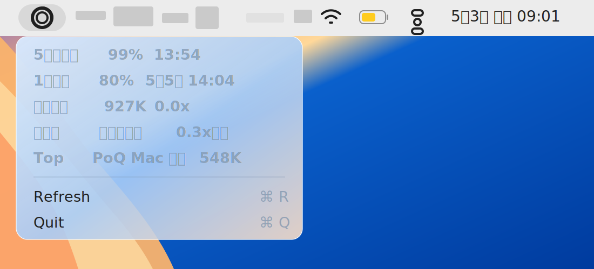

# Codex Battery

一个 macOS 菜单栏里的 Codex 额度电池。



你是不是总是担心 Codex 额度突然用完？

你是不是一边让 agent 干活，一边忍不住反复点开“剩余额度”确认自己还能撑多久？

Codex Battery 就是给“额度不足焦虑症患者”准备的小工具：它把 Codex 额度做成 macOS 状态栏里的电池图标，让你像看电脑电量一样，轻松看到当前消耗情况。

它不只显示剩余额度，还会帮你判断：这一周的额度，按现在的节奏够不够用。

少点几次额度页面，把宝贵的注意力和 token 都留给真正的工作。

Codex Battery 会把 Codex 额度变成一个紧凑的菜单栏信号：

- 外圈：1 周额度剩余
- 内圈：5 小时额度剩余
- 菜单详情：重置时间、今日 token 消耗、周预算预测、当前消耗最高的 Codex 对话

它只读取本机 `~/.codex` 下的状态和日志，不上传数据，不需要网页登录，也不打扰你的工作流。

## 为什么做这个

长时间用 Codex 做 agentic work 时，额度会变成真实的工作流约束。官方 UI 能看，但不够像电池一样常驻。Codex Battery 的目标很简单：让你不用反复点“剩余额度”，也能知道自己现在是不是安全。

它主要回答：

- 5 小时额度快撞墙了吗？
- 这一周额度能撑到重置吗？
- 今天是不是异常高消耗？
- 哪个 Codex 对话最耗 token？

## 安装

要求：

- macOS 14+
- Xcode Command Line Tools，包含 `swiftc`
- Codex desktop app，并且本机存在 `~/.codex` 状态

### Homebrew

```bash
brew install EOShoow/tap/codex-battery
codex-battery
```

可选：安装登录启动项：

```bash
codex-battery-login install
```

移除登录启动项：

```bash
codex-battery-login uninstall
```

### 源码安装

```bash
git clone https://github.com/EOShoow/codex-battery.git
cd codex-battery
./install.sh
```

应用会安装到：

```text
~/Applications/CodexQuota.app
```

登录启动项会安装到：

```text
~/Library/LaunchAgents/local.codex.quota.menu.plist
```

## 菜单怎么读

示例：

```text
5小时剩余  99%    5月2日 02:16
1周剩余    82%    5月5日 14:04
今日消耗    183.8M 14.1x    今日冲高
周预测      可撑到重置  0.4x预算
Top         PoQ Mac 复刻  91.7M
```

`1.0x预算` 表示你的周额度消耗刚好在线性预算线上。例如一周已经过去 50%，你也刚好用了 50% 的周额度，就是 `1.0x预算`。

- 低于 `1.0x`：比预算安全
- 约等于 `1.0x`：按当前节奏刚好撑到重置
- 高于 `1.0x`：快于预算，可能提前耗尽

## 刷新机制

Codex Battery 会在这些时机刷新：

- 启动时
- 每 5 分钟
- 打开菜单时
- 点击 `Refresh` 时

## 准确性

这是非官方的本地估算工具。它依赖 Codex 写入本机状态和 rollout 日志。如果 Codex 还没把最新事件落盘，Codex Battery 也读不到。

适合当快速仪表盘，不适合作为严格账单来源。

## 隐私

Codex Battery 不上传任何数据，也不发起网络请求。

它读取：

- `~/.codex/state_5.sqlite`
- 该数据库引用的近期 rollout 日志

对话标题只在本机菜单里显示，用于判断哪个对话最耗 token。

## 更新

```bash
git pull
./install.sh
```

## 卸载

```bash
./uninstall.sh
```

## 手动构建

```bash
./build.sh
open ~/Applications/CodexQuota.app
```

## 状态

早期版本。Codex 本地状态格式可能变化，欢迎提 issue 或 PR。

## License

MIT
