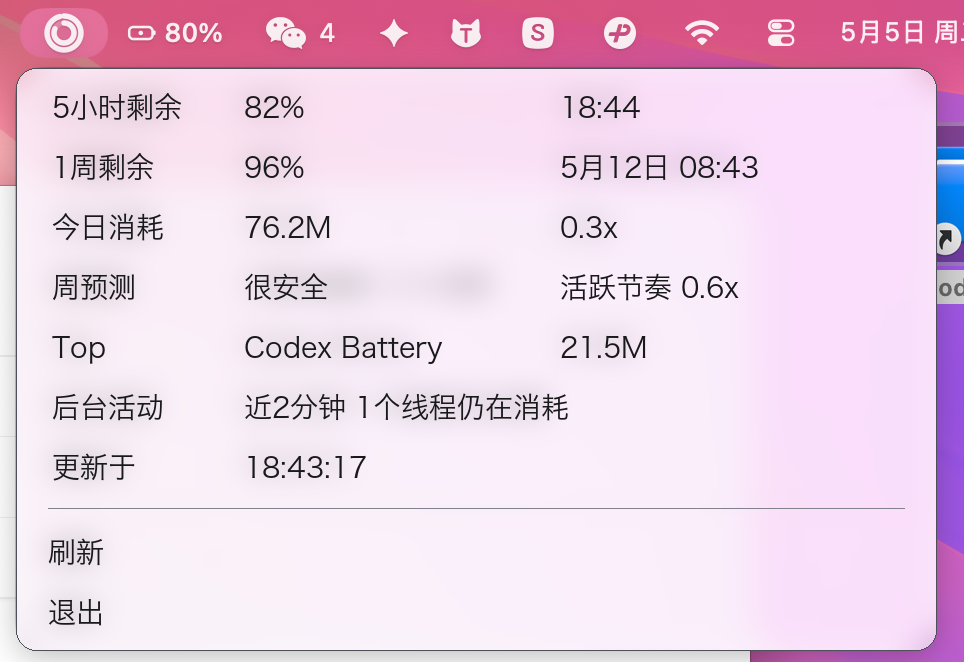
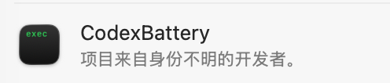

# Codex Battery


一个常驻 macOS 菜单栏的 Codex 额度看板。



你是不是总是担心 Codex 额度突然用完？

你是不是一边让 agent 干活，一边忍不住反复点开“剩余额度”确认自己还能撑多久？

Codex Battery 就是给“额度不足焦虑症患者”准备的小工具：它把 Codex 额度做成 macOS 状态栏里的电池图标，让你像看电脑电量一样，轻松看到当前消耗情况。

它不只显示剩余额度，还会帮你判断：这一周的额度，按现在的节奏够不够用。

少点几次额度页面，把宝贵的注意力和 token 都留给真正的工作。

Codex Battery 会把 Codex 额度变成一个紧凑的菜单栏信号：

- 外圈：1 周额度剩余
- 内圈：5 小时额度剩余
- 菜单详情：重置时间、今日 token 消耗、周预算预测、当前消耗最高的 Codex 对话、近期后台活动、数据生成时间

它只读取本机 `~/.codex` 下的状态和日志，不上传数据，不需要网页登录，也不打扰你的工作流。

## 为什么做这个

长时间用 Codex 做 agentic work 时，额度会变成真实的工作流约束。官方 UI 能看，但不够像电池一样常驻。Codex Battery 的目标很简单：让你不用反复点“剩余额度”，也能知道自己现在是不是安全。

它主要回答：

- 5 小时额度快撞墙了吗？
- 这一周额度能撑到重置吗？
- 今天是不是异常高消耗？
- 哪个 Codex 对话最耗 token？

如果你在 Codex 侧边栏里给对话改了名，`Top` 行会优先使用本地 session index 里记录的最新名称，而不是继续显示创建时的首条消息摘要。

## 安装

要求：

- macOS 14+
- Xcode Command Line Tools，包含 `swiftc`
- Codex desktop app，并且本机存在 `~/.codex` 状态

### Homebrew

```bash
brew install EOShoow/tap/codex-battery
codex-battery
```

可选：安装登录启动项：

```bash
codex-battery-login install
```

移除登录启动项：

```bash
codex-battery-login uninstall
```

### 源码安装

```bash
git clone https://github.com/EOShoow/codex-battery.git
cd codex-battery
./install.sh
```

应用会安装到：

```text
~/Applications/CodexBattery.app
```

登录启动项会安装到：

```text
~/Library/LaunchAgents/local.codex.battery.menu.plist
```

### 关于“身份不明的开发者”



Codex Battery 目前还没有使用付费 Apple Developer ID 签名，所以 macOS 可能会在“登录项”或 Gatekeeper 提示里显示“身份不明的开发者”。

这个提示说的是 Apple 代码签名身份，不等于这个工具会收集你的数据。项目是开源的，会向本机 Codex app-server 询问额度状态，并读取本机 `~/.codex` 下的 Codex 状态和日志作为统计兜底。

如果你比较谨慎，可以先看源码，再用 `./install.sh` 从源码安装。当前 Homebrew formula 也是从这个仓库拉源码后在本机编译，不是下载闭源二进制。

## 菜单怎么读

示例：

```text
5小时剩余  82%    18:44
1周剩余    96%    5月12日 08:43
今日消耗    76.2M  0.3x
周预测      很安全  活跃节奏 0.6x
Top         Codex Battery  21.5M
后台活动    近2分钟 1个线程仍在消耗
数据于      18:43:17
```

`活跃节奏 1.0x` 表示你的周额度消耗刚好在活跃小时预算线上。Codex Battery 会统计最近 5 分钟活跃桶，并按 `8h/天` 的工作日预算对比，所以睡觉和离开电脑的空闲时间不会继续拉高预测值。

- 低于 `1.0x`：比预算安全
- 约等于 `1.0x`：按当前节奏刚好撑到重置
- 高于 `1.0x`：快于预算，可能提前耗尽

`数据于` 是当前额度快照的时间。正常情况下它来自 Codex app-server 的 `account/rateLimits/read` 返回，和原生 Codex 额度面板更接近；如果这个请求失败，Codex Battery 会回退到本机最新的 `token_count` 事件，此时这个时间就是该事件的生成时间。

如果 5 小时或 1 周窗口的重置时间已经过去，但 Codex 还没有写入新的 usage 事件，Codex Battery 会把这个窗口视为已重置，显示 `100%` 和 `已重置`。

如果某一行因为太长出现省略号，鼠标悬停可以看到完整内容。

## 刷新机制

Codex Battery 会在这些时机刷新：

- 启动时
- 点击 `刷新` 时
- 空闲时每 30 分钟刷新
- 检测到近期 Codex 活动时每 5 分钟刷新
- 刷新失败后每 5 分钟重试

打开菜单默认不会刷新，因为额度刷新会启动本机 Codex app-server，有一定功耗。如果你想恢复旧行为，可以在菜单里打开 `打开菜单时刷新：开`。

为了避免你从空闲重新开始工作后还卡在 30 分钟等待里，Codex Battery 会额外每 60 秒跑一次轻量活动探针。这个探针只读本机状态和最近 rollout 日志尾部，不启动 Codex app-server；如果发现从空闲变成活跃，就立即触发一次完整刷新。

自动刷新间隔也可以自己填：

```bash
defaults write local.codex.battery.menu activeRefreshMinutes -int 5
defaults write local.codex.battery.menu idleRefreshMinutes -int 30
defaults write local.codex.battery.menu failureRetryMinutes -int 5
defaults write local.codex.battery.menu activityProbeSeconds -int 60
```

为了降低功耗，它会先向本机 Codex app-server 获取当前账号额度，再只检查最近活跃的线程，并读取每个 rollout 日志的尾部来计算今日、Top 和预测统计。

如果后台 Codex 任务仍在运行，菜单会显示 `后台活动` 行，例如 `近2分钟 2 个线程仍在消耗`。这用于提醒你：即使当前对话没有输入，额度也可能因为后台自动化继续变化。

如果 Codex 正在写入、checkpoint 或迁移 `~/.codex/state_5.sqlite`，读取可能会瞬时失败。Codex Battery 会先重试多次；如果仍然失败，但之前已经成功读到过数据，就继续显示上一份成功快照，并把检查状态标为 `旧数据`，而不是把整个菜单替换成错误。

## 准确性

这是非官方的本地看板。5 小时和 1 周额度现在优先读取原生 Codex UI 使用的本机 app-server 账号额度路径；今日消耗、Top、周预测仍来自本机 rollout 日志，所以这些辅助统计在 Codex 尚未落盘最新事件时仍可能滞后。

适合当快速仪表盘，不适合作为严格账单来源。

## 兼容性

Codex Battery 依赖 Codex Desktop 的本机 app-server 协议和本地状态格式，主要是 `account/rateLimits/read`、`~/.codex/state_5.sqlite`，以及这个数据库引用的 rollout 日志。

这不是 Codex 官方公开 API。如果未来 Codex Desktop 升级后修改了 app-server 协议、本地数据库结构、日志路径布局，或者 `token_count` 事件格式，Codex Battery 可能会暂时读不到数据，需要更新后才能恢复。

当前已知基线：

- 已在 2026-05-05 的 Codex Desktop `26.429.30905` / app-server 协议上验证
- 通过本机 `codex app-server` 的 `account/rateLimits/read` 读取额度
- 读取 `~/.codex/state_5.sqlite`
- 读取包含 `token_count.rate_limits` 的近期 rollout 日志

如果 Codex 升级后失效，请开 issue，并附上 Codex 版本、macOS 版本、菜单里显示的错误文本。不要直接粘贴私密 rollout 日志；如果必须提供，请先自行检查和脱敏。

## 反馈入口

- 兼容性反馈：[提交兼容性 issue](https://github.com/EOShoow/codex-battery/issues/new?template=compatibility-report.yml)
- Bug 反馈：[提交 bug report](https://github.com/EOShoow/codex-battery/issues/new?template=bug-report.yml)
- 使用问题和安装经验：[GitHub Discussions](https://github.com/EOShoow/codex-battery/discussions)

## 隐私

Codex Battery 不上传你的 rollout 日志、对话内容或本地统计。核心额度读取会启动本机 Codex app-server 并请求 `account/rateLimits/read`；根据 Codex 内部实现，这个 app-server 请求可能会使用你已有的 Codex 登录态访问 Codex/OpenAI，行为类似打开原生额度面板。

它还会在本机读取：

- `~/.codex/state_5.sqlite`
- 该数据库引用的近期 rollout 日志

对话标题只在本机菜单里显示，用于判断哪个对话最耗 token。

## 更新

```bash
git pull
./install.sh
```

## 卸载

```bash
./uninstall.sh
```

## 手动构建

```bash
./build.sh
open ~/Applications/CodexBattery.app
```

## 状态

早期版本。Codex 本地状态格式可能变化，欢迎提 issue 或 PR。

## License

MIT
