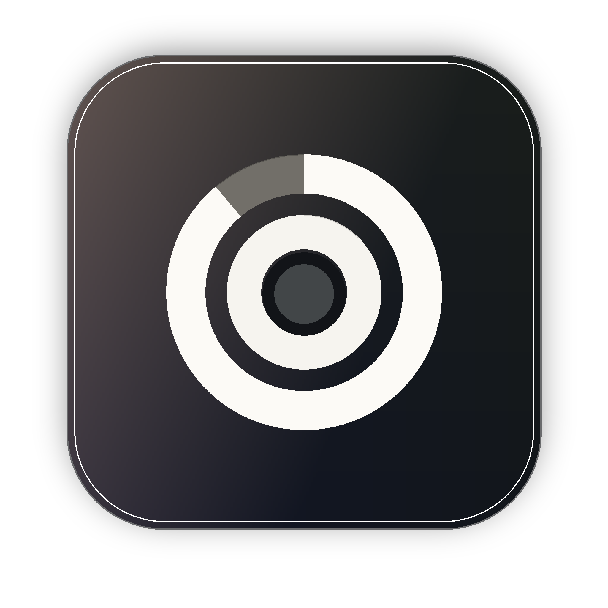
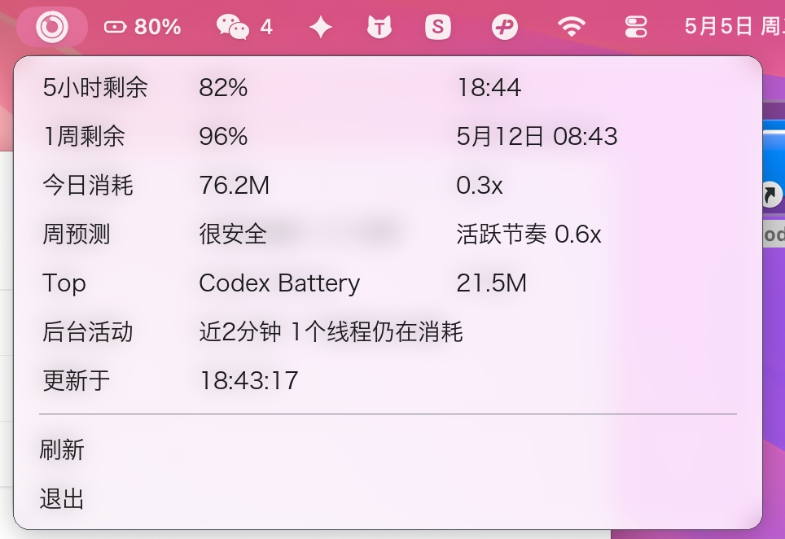
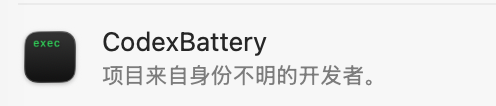

# Codex Battery



一个常驻 macOS 菜单栏的 Codex 额度看板。



你是不是总是担心 Codex 额度突然用完？

你是不是一边让 agent 干活，一边忍不住反复点开“剩余额度”确认自己还能撑多久？

Codex Battery 就是给“额度不足焦虑症患者”准备的小工具：它把 Codex 额度做成 macOS 状态栏里的电池图标，让你像看电脑电量一样，轻松看到当前消耗情况。

它不只显示剩余额度，还会帮你判断：这一周的额度，按现在的节奏够不够用。

少点几次额度页面，把宝贵的注意力和 token 都留给真正的工作。

Codex Battery 会把 Codex 额度变成一个紧凑的菜单栏信号：

- 额度环会跟随 Codex 实际返回的窗口自动变化：同时有周额度和 5 小时额度时显示双环，仅返回周额度时只显示外环
- 中心骰子点阵：当前可用的完整额度重置次数；图标最多显示六点，Tooltip 保留真实次数
- 图标样式：可从菜单的“图标样式”切换“骰子双环（重置次数）”或“圆环闪电（速度档位）”，选择只保存在本机
- 菜单详情：重置时间、可用完整重置次数及到期日期、今日 token 消耗、额度油耗参考、周预算预测、当前消耗最高的 Codex 对话、近期后台活动、数据生成时间

它只读取本机 `~/.codex` 下的状态和日志，不上传数据，不需要网页登录，也不打扰你的工作流。

## 为什么做这个

长时间用 Codex 做 agentic work 时，额度会变成真实的工作流约束。官方 UI 能看，但不够像电池一样常驻。Codex Battery 的目标很简单：让你不用反复点“剩余额度”，也能知道自己现在是不是安全。

它主要回答：

- 5 小时额度快撞墙了吗？
- 这一周额度能撑到重置吗？
- 今天已经消耗了多少 token？
- 哪个 Codex 对话最耗 token？

如果你在 Codex 侧边栏里给对话改了名，`Top` 行会优先使用本地 session index 里记录的最新名称，而不是继续显示创建时的首条消息摘要。

## 安装

要求：

- macOS 14+
- Xcode Command Line Tools，包含 `swiftc`
- Codex desktop app，并且本机存在 `~/.codex` 状态

### Homebrew

```bash
brew install EOShoow/tap/codex-battery
codex-battery
```

可选：安装登录启动项：

```bash
codex-battery-login install
```

移除登录启动项：

```bash
codex-battery-login uninstall
```

### 源码安装

```bash
git clone https://github.com/EOShoow/codex-battery.git
cd codex-battery
./install.sh
```

应用会安装到：

```text
~/Applications/CodexBattery.app
```

登录启动项会安装到：

```text
~/Library/LaunchAgents/local.codex.battery.menu.plist
```

### 关于“身份不明的开发者”



Codex Battery 目前还没有使用付费 Apple Developer ID 签名，所以 macOS 可能会在“登录项”或 Gatekeeper 提示里显示“身份不明的开发者”。

这个提示说的是 Apple 代码签名身份，不等于这个工具会收集你的数据。项目是开源的，会向本机 Codex app-server 询问额度状态，并读取本机 `~/.codex` 下的 Codex 状态和日志作为统计兜底。

如果你比较谨慎，可以先看源码，再用 `./install.sh` 从源码安装。当前 Homebrew formula 也是从这个仓库拉源码后在本机编译，不是下载闭源二进制。

## 菜单怎么读

示例（应用里的周预测会显示为小型趋势图）：

```text
5小时剩余  82%    18:44
1周剩余    96%    5月12日 08:43
可用重置    4次    最近 5月10日到期 ›
今日消耗    76.2M
额度油耗    今日约 4%   本期4% · 常态17%/日
周预测      存在提前用完风险  低 · 常态2期
Top         Codex Battery  21.5M
后台活动    近2分钟 1个线程仍在消耗
数据于      18:43:17
```

图示化周预测包含三条趋势线和一类到期标记：

- 灰色对角线：刚好在重置时用完 100% 的均匀预算线
- 实线：本机 Codex 快照记录的本周真实消耗
- 彩色虚线：预测走势；绿色表示余量舒适，橙色表示接近用完，红色表示预计会提前耗尽

如果有可用完整重置，菜单会单独显示次数。点开该行可查看 API 已返回的每个准确到期日期；如果次数多于有效日期，列表会明确提示还有多少次未返回日期。当前周时间轴范围内最近到期的一批会在预测图上显示橙色竖线和日期，24 小时内到期时改为红色。落在本周额度重置之后的日期仍保留在展开列表里，避免为了显示更远日期而扭曲周预测横轴。

预测会把“通常什么时候工作”和“通常多快消耗额度”分开处理：当前 reset 窗口的额度快照合并为 5 分钟桶，此前 28 个完整自然日的 15 分钟活跃桶形成“星期 × 小时”作息画像；历史消耗速度则取近期额度周期的稳健中位数，并优先采用持续至少 3 天的周期，避免短期完整重置冲量主导下一周。当前周期只有形成持续证据后才逐步增加权重；如果历史常态不足，新周期前 12 小时只显示“样本积累中”，不会直接给出确定的提前耗尽日期。

`额度油耗` 是预测背后的事实参考：左侧依据本地可用的最近午夜快照估算今天周额度增加了多少个百分点，右侧显示历史常态日均；Tooltip 还会给出本周期累计值和当前周期直接折算的日均值。Token 数继续单独显示，因为 token 数量和额度百分比没有稳定换算关系。当稳健预测区间跨过 100% 用完线时，菜单只显示橙色风险提示；只有速度证据成熟且整个区间都越线时，才显示红色的确定性提前耗尽结论。

`数据于` 是当前额度快照的时间。正常情况下它来自 Codex app-server 的 `account/rateLimits/read` 返回，和原生 Codex 额度面板更接近；如果首次读取实时额度前这个请求失败，Codex Battery 会回退到本机最新的 `token_count` 事件，此时这个时间就是该事件的生成时间。已经缓存过实时额度后，如果后续刷新失败，它会继续显示上一份实时快照并标记为 `旧数据`，不会再用更旧的 rollout 日志额度覆盖菜单。

如果 5 小时或 1 周窗口的重置时间已经过去，但 Codex 还没有写入新的 usage 事件，Codex Battery 会把这个窗口视为已重置，显示 `100%` 和 `已重置`。

Codex 可能阶段性只返回周额度窗口。此时 Codex Battery 会隐藏不可用的 5 小时行和内环；后续重新返回双窗口时，5 小时行和第二个环会自动恢复。

如果某一行因为太长出现省略号，鼠标悬停可以看到完整内容。

## 刷新机制

Codex Battery 会在这些时机刷新：

- 启动时
- 点击 `刷新` 时
- 空闲时每 30 分钟刷新
- 检测到近期 Codex 活动时每 5 分钟刷新
- 刷新失败后每 5 分钟重试

打开菜单时会智能校准官方额度：如果账号额度快照已经超过 60 秒，Codex Battery 会执行一次只读额度刷新；连续打开菜单会按 60 秒防抖，也不会推迟原有后台刷新计划。只有确实需要打开菜单时同步重算今日消耗、Top 和周预测时，才打开 `打开时完整刷新：开`；完整刷新同样限制为每分钟最多一次。

为了避免你从空闲重新开始工作后还卡在 30 分钟等待里，Codex Battery 会额外每 5 分钟跑一次轻量活动探针。这个探针只读本机状态和最近 rollout 日志尾部，不启动 Codex app-server；如果发现从空闲变成活跃，就触发一次账号额度刷新。

活跃期间每 5 分钟的自动刷新只读取官方账号额度。用于计算今日消耗、Top 和周预测的本地详情扫描只在启动、手动刷新以及后台每小时最多一次时运行；最近线程精确读取，旧线程按日期抽样少量日志尾部，用来学习活跃时段而不做全盘扫描。

自动刷新间隔也可以自己填：

```bash
defaults write local.codex.battery.menu activeRefreshMinutes -int 5
defaults write local.codex.battery.menu idleRefreshMinutes -int 30
defaults write local.codex.battery.menu failureRetryMinutes -int 5
defaults write local.codex.battery.menu activityProbeSeconds -int 300
defaults write local.codex.battery.menu detailRefreshMinutes -int 60
```

为了降低功耗，常规自动刷新只向本机 Codex app-server 获取当前账号额度；频率更低的详情刷新才会检查最近活跃线程并读取 rollout 尾部，计算今日、Top 和预测统计。

如果后台 Codex 任务仍在运行，菜单会显示 `后台活动` 行，例如 `近2分钟 2 个线程仍在消耗`。这用于提醒你：即使当前对话没有输入，额度也可能因为后台自动化继续变化。

如果 Codex 正在写入、checkpoint 或迁移 `~/.codex/state_5.sqlite`，或本机 app-server 额度读取短暂失败，刷新可能会失败。Codex Battery 会先重试多次；如果之前已经读到过实时额度，就继续显示上一份成功快照，并把检查状态标为 `旧数据`，而不是把整个菜单替换成错误或更旧的 rollout 日志额度。

## 准确性

这是非官方的本地看板。5 小时和 1 周额度优先读取原生 Codex UI 使用的本机 app-server 账号额度路径；今日消耗和 Top 来自本机 rollout 日志。周预测只在本机内存中使用分桶后的活动时间和额度变化，不保存对话正文或标题画像；当 Codex 尚未落盘近期事件时，历史走势仍可能滞后。预测置信度现在反映消耗速度证据，不再只看活跃历史量；它仍然是当前节奏估计，不代表额度保证。

适合当快速仪表盘，不适合作为严格账单来源。

## 兼容性

Codex Battery 依赖 Codex Desktop 的本机 app-server 协议和本地状态格式，主要是 `account/rateLimits/read`、`~/.codex/state_5.sqlite`，以及这个数据库引用的 rollout 日志。

这不是 Codex 官方公开 API。如果未来 Codex Desktop 升级后修改了 app-server 协议、本地数据库结构、日志路径布局，或者 `token_count` 事件格式，Codex Battery 可能会暂时读不到数据，需要更新后才能恢复。

当前已知基线：

- 已在 2026-05-05 的 Codex Desktop `26.429.30905` / app-server 协议上验证
- 已在 2026-05-22 的 Codex Desktop `26.519.31651` 上验证
- 已在 2026-07-10 的 ChatGPT for macOS 内置 Codex 上验证
- 已在 2026-07-14 的 Codex for macOS 单周额度返回结构上验证
- 通过本机 `codex app-server` 的 `account/rateLimits/read` 读取额度
- 同时兼容 `/Applications/ChatGPT.app` 内置 app-server 和旧版 `/Applications/Codex.app`
- 读取 `~/.codex/state_5.sqlite`
- 从 `rateLimitResetCredits.availableCount` 读取可用完整重置次数，并只提取可用 credit 的 `expiresAt` 用于本机日期列表和时间轴标记；实时字段不可用时中心留空
- 读取包含 `token_count.rate_limits` 的近期 rollout 日志

如果 Codex 升级后失效，请开 issue，并附上 Codex 版本、macOS 版本、菜单里显示的错误文本。不要直接粘贴私密 rollout 日志；如果必须提供，请先自行检查和脱敏。

## 反馈入口

- 兼容性反馈：[提交兼容性 issue](https://github.com/EOShoow/codex-battery/issues/new?template=compatibility-report.yml)
- Bug 反馈：[提交 bug report](https://github.com/EOShoow/codex-battery/issues/new?template=bug-report.yml)
- 使用问题和安装经验：[GitHub Discussions](https://github.com/EOShoow/codex-battery/discussions)

## 隐私

Codex Battery 不上传你的 rollout 日志、对话内容或本地统计。核心额度读取会启动本机 Codex app-server 并请求 `account/rateLimits/read`；根据 Codex 内部实现，这个 app-server 请求可能会使用你已有的 Codex 登录态访问 Codex/OpenAI，行为类似打开原生额度面板。

它还会在本机读取：

- `~/.codex/state_5.sqlite`
- 该数据库引用的近期 rollout 日志

对话标题只在本机菜单里显示，用于判断哪个对话最耗 token。

## 更新

```bash
git pull
./install.sh
```

## 卸载

```bash
./uninstall.sh
```

## 手动构建

```bash
./build.sh
open ~/Applications/CodexBattery.app
```

## 状态

早期版本。Codex 本地状态格式可能变化，欢迎提 issue 或 PR。

## License

MIT
